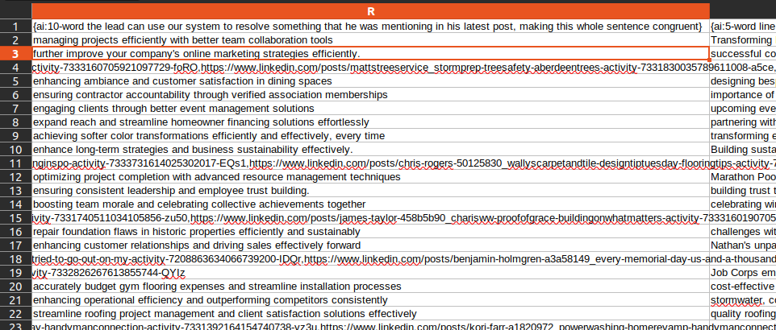

# Download Your Leads

Once your scraping order has processed some leads, you can download the enriched data in a CSV file.

To download:

1. Go to your dashboard
2. Locate the order card
3. [Click the download icon](./2-check-your-orders.md#️-download-your-leads) 📥

This file contains everything you need to run outbound campaigns, including:

- Verified email addresses
- Phone numbers
- Job titles, companies, and locations
- Post links
- AI-generated personalization snippets

---

## CSV Columns Explained

Below is a breakdown of each column included in your download:

| Column                | Description |
|----------------------|-------------|
| id_lead              | Unique internal ID of the lead (used for deduplication or merging across systems). |
| first_name           | First name of the lead (parsed from LinkedIn). |
| last_name            | Last name of the lead. |
| job_title            | The headline or job title from LinkedIn. |
| email                | Email address (if found and valid). |
| email_verification_result | Email status (e.g. “valid”). |
| phone                | Phone number (if requested in your order). |
| linkedin             | Link to the lead’s LinkedIn profile. |
| country_name         | Country where the lead is located. |
| location_name        | Full city, state, and country string. |
| company_name         | Name of the company where the lead works. |
| company_domain       | Website domain of the company. |
| company_headcount    | Estimated size of the company (e.g. “11-50”). |
| all_industries       | General industry category from LinkedIn or external enrichment. |
| company_industries   | Refined or appended version of industry. |
| posts                | Link to the original LinkedIn post that matched your filters. |
| ai:{...}             | Personalized snippets generated by AI based on the lead’s post. These are ready to use in outreach messages. |

---

## Examples of Personalization Fields

You requested personalisation merge-tags in the [step 3 of your new order placing](./1-placing-a-scraping-order.md#step-3--generate-a-personalized-script).

Your CSV file includes dynamic fields like:

- {ai:5-word summary of post}
- {ai:10-word use-case}
- {ai:personalized hook for intro}

These are shown in columns like:

You can insert them into your outbound scripts using merge tags.

