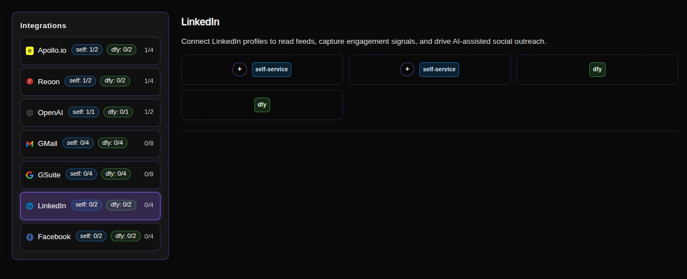
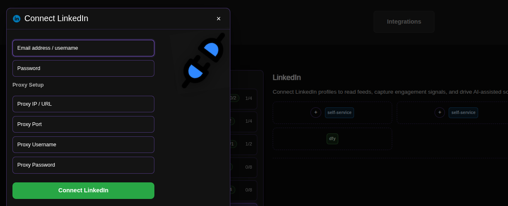

# Connecting LinkedIn for Scraping and Sending Messages

LinkedIn integration is your gateway to social selling at scale. By connecting LinkedIn profiles, MassProspecting can read feed activities, capture valuable engagement signals, and drive AI-assisted outreach through connection requests and messages, transforming your LinkedIn presence into a powerful lead generation channel.

## Step-by-Step Connection Guide

### 1. Access the Integrations Page
Navigate to the LinkedIn integration page in your MassProspecting dashboard:
**https://massprospecting.com/app/integrations/linkedin**

### 2. Check Available Slots
On the integrations page, you'll see the status of the LinkedIn service with available connection slots:

*   **Self-service slots (`self`)**: Available for your profile connections
*   **DFY slots (`dly`)**: Managed by the MassProspecting team

The notation indicates:
*   `(self: X/Y)` - Your available/used self-service slots (typically 0/2 available when starting)
*   `(dly: X/Y)` - Available/used Done-For-You slots
*   Multiple slots allow connecting several LinkedIn accounts for scaled activities

### 3. Connect Your LinkedIn Account
Find an available **self-service** slot and click the **plus button (+)** to configure your connection.

### 4. Enter Account and Proxy Credentials

You'll need to provide your LinkedIn credentials and proxy information for secure and reliable access.

**Required Information:**
*   **Email address/username:** Your LinkedIn login email
*   **Password:** Your LinkedIn account password
*   **Proxy Setup:** Essential for avoiding detection and restrictions

**Proxy Recommendation:**
We strongly recommend using static residential proxies from **Proxy-Cheap.com** for optimal performance and reliability. Residential proxies appear as regular user connections, significantly reducing the risk of being flagged or blocked by LinkedIn.

**How the Connection Works:**
MassProspecting will create a dedicated browser instance with your specified proxy configuration and attempt to log in using your credentials. Note that LinkedIn may require email verification during the initial login process, so please have access to your email inbox ready.

### 5. Complete the Connection
Fill in all required fields with your proxy details and LinkedIn credentials, then click **Connect LinkedIn** to establish the connection.

### 6. Managing Your Connections
To release an occupied slot (to remove or replace a LinkedIn account), click the **Disconnect** button associated with that specific connection.

## Key Benefits: Social Selling Automation

This integration enables:
*   **Feed Monitoring:** Read and analyze LinkedIn feed activities for engagement signals
*   **Smart Scraping:** Extract valuable prospect data from profiles and search results
*   **AI-Assisted Outreach:** Send personalized connection requests and messages
*   **Signal Capture:** Identify warm leads based on job changes, content engagement, and other activities
*   **Multi-Account Management:** Run several LinkedIn profiles simultaneously

## Best Practices

*   **Proxy Quality:** Always use high-quality residential proxies to avoid detection
*   **Account Warm-up:** Gradually increase activity levels for new connections
*   **Human-like Behavior:** Mimic organic usage patterns to maintain account health
*   **Regular Verification:** Monitor accounts for verification requests or security challenges

## Troubleshooting

*   **Login Issues:** Ensure credentials are correct and accounts aren't restricted
*   **Proxy Errors:** Verify proxy credentials and check proxy service status
*   **Verification Required:** Be prepared to complete email or SMS verification during setup
*   **Connection Limits:** Respect LinkedIn's rate limits to avoid temporary restrictions

For problems with **DFY slots** or complex setup requirements, contact our support team for assistance.